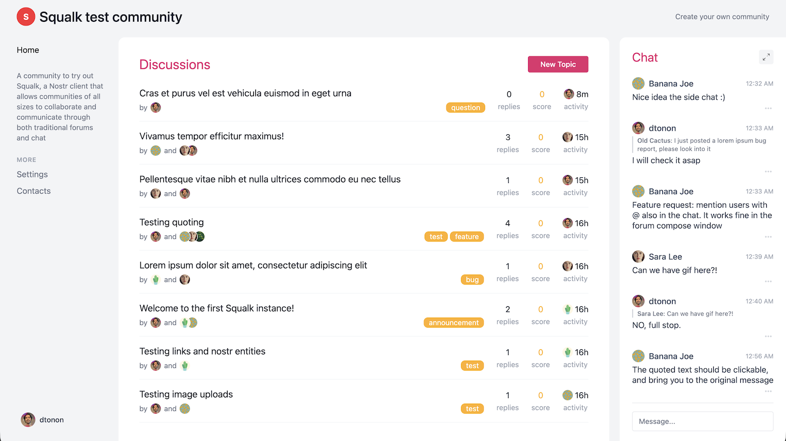
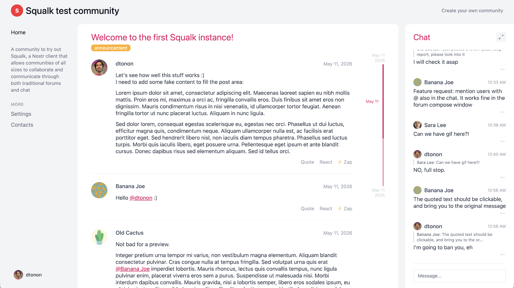

# Squalk

**Warning: work in progress, early alpha state!**

Squalk is a forum built on Nostr that permits to manage simple or large communities; in fact you can choose to setup it in "simple" or "full" mode. Simple mode expose a single forum, while in Full mode you can have as many forum as you like.  
Each forum includes a chat feature in the right-hand sidebar, which is useful for quickly interacting with members.





## Tech stack

Squalk is built on Nostr and implement [NIP-29](https://github.com/nostr-protocol/nips/blob/master/29.md) and [NIP-7D](https://github.com/nostr-protocol/nips/blob/master/7D.md).  
It needs a personal relay that supports NIP-29 to host the group(s) and a Blossom server for the uploads; [Pyramid](https://github.com/fiatjaf/pyramid) includes both and is the suggested solution.

## Developing

Once you've created a project and installed dependencies with `npm install` (or `pnpm install` or `yarn`), start a development server:

```sh
npm run dev

# or start the server and open the app in a new browser tab
npm run dev -- --open
```

## Building

To create a production version of your app:

```sh
npm run build
```

You can preview the production build with `npm run preview`.

> To deploy your app, you may need to install an [adapter](https://svelte.dev/docs/kit/adapters) for your target environment.
