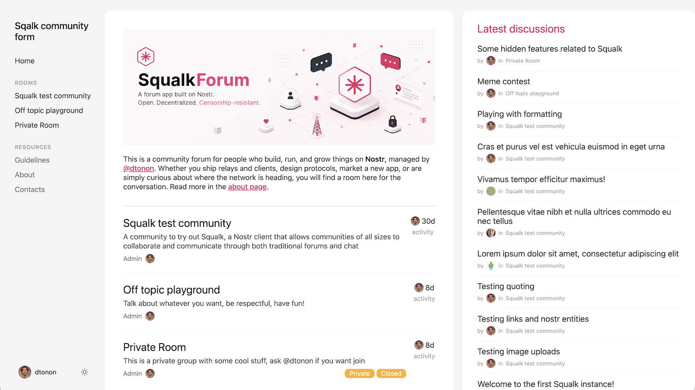
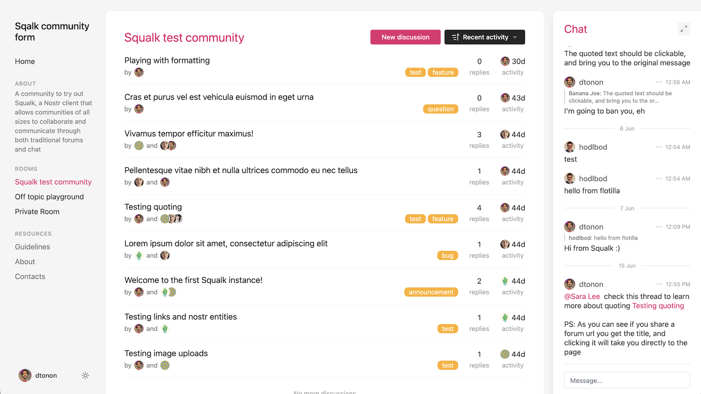
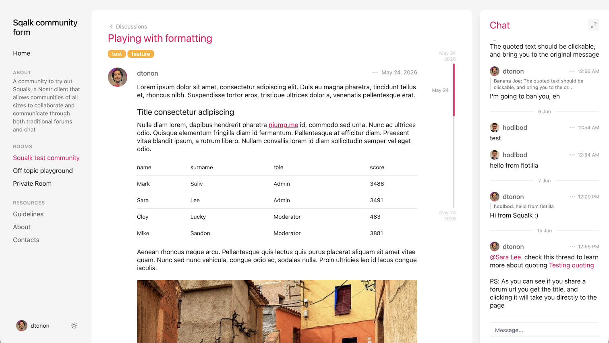
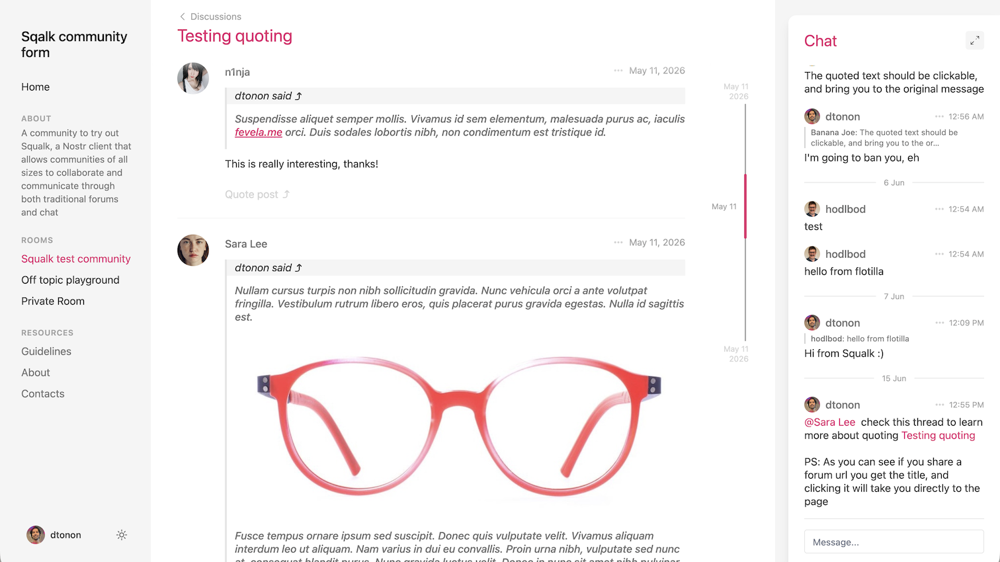

# Squalk

Squalk is a forum built on Nostr that permits to manage simple or large communities; in fact you can choose to setup it in "simple" or "full" mode. Simple mode expose a single forum, while in Full mode you can have as many forum as you like.  
Each forum includes a chat feature in the right-hand sidebar, which is useful for quickly interacting with members.









## Tech stack

Squalk is built on Nostr and implement [NIP-29](https://github.com/nostr-protocol/nips/blob/master/29.md) and [NIP-7D](https://github.com/nostr-protocol/nips/blob/master/7D.md).  
It needs a personal relay that supports NIP-29 to host the group(s) and a Blossom server for the uploads; [Pyramid](https://github.com/fiatjaf/pyramid) includes both and is the suggested solution.

## Configuration

Squalk is configured entirely through environment variables (all prefixed `PUBLIC_`, since they are read in the browser). Copy `.env.example` to `.env` and fill in the values; SvelteKit also reads `.env.development` (used by `npm run dev`) and `.env.production` (used by `npm run build`).

| Variable | Required | Default | Description |
| --- | --- | --- | --- |
| `PUBLIC_RELAY_URL` | yes | — | WebSocket URL of the NIP-29 relay hosting the group(s), e.g. `wss://relay.example.com`. |
| `PUBLIC_MODE` | no | `simple` | `simple` (a single forum) or `full` (multiple rooms). The admin can later upgrade simple → full at runtime. |
| `PUBLIC_GROUP_ID` | in simple mode | — | The single forum's group id. Required when `PUBLIC_MODE=simple`; ignored in full mode, where rooms are selected at runtime. |
| `PUBLIC_TITLE` | no | group name | Title shown in the top bar. When empty it falls back to the group's name. |
| `PUBLIC_JOINCODE` | no | `no` | `yes` to show an invite-code field when a join request is rejected (for code-gated relays). |
| `PUBLIC_SSR` | no | `no` | `yes` to render pages on the server (crawlable HTML, real 404s). The build then targets Node (`node build`) instead of a static bundle; see [Deploying](#deploying). |
| `PUBLIC_SEARCH` | no | `no` | `yes` to show a search box at the top of the homepage. Requires a relay with NIP-50 search support. |
| `PUBLIC_LABELS` | no | — | Comma-separated discussion labels offered when composing, e.g. `bug,feature,question`. |
| `PUBLIC_BLOSSOM_URL` | no | — | Blossom server URL used for media uploads, e.g. `https://blossom.primal.net`. Uploads are disabled when unset. |
| `PUBLIC_ACCENT_COLOR` | no | `#e32a6d` | Override the accent (primary) color. Quote the value (`"#00ff00"`) — an unquoted leading `#` is read as a comment. The hover shade is derived automatically. |
| `PUBLIC_SECONDARY_COLOR` | no | `#ffaf25` | Override the secondary color. Same quoting rule and derived hover shade as above. |

## Customizing content

Squalk fills its sidebar links and personalizes the homepage and contacts page from NIP-23 long-form events (kind `30023`) published to the same relay that hosts the group(s). Only events authored by a forum admin (a pubkey listed in a group's NIP-29 `39001` admin event) are surfaced — the relay query is open, so the admin set is the trust gate.

Content is plain markdown. The sample `.md` files in the repo root (`about.md`, `guidelines.md`, `homepage.md`, `contacts.md`) are starting points you can adapt and publish.

### Resources (sidebar links)

Resources appear in the left sidebar and are served at `/resource/<slug>`. Publish a kind `30023` event with:

| Tag | Required | Purpose |
| --- | --- | --- |
| `["t", "squalk-resource"]` | yes | marks the event as a resource |
| `["d", "<slug>"]` | yes | the `d`/identifier tag — also the URL slug (`/resource/<slug>`) |
| `["title", "<title>"]` | recommended | label shown in the sidebar (falls back to the slug) |
| `["position", "<n>"]` | optional | ordering hint, ascending |

The `content` field is the markdown body. Ordering: resources with a `position` come first, sorted ascending; ties and unpositioned resources fall back to alphabetical order by title. Because events are addressable, re-publishing with the same `d` slug updates the resource (newest wins).

Example (the `about` resource linked from the homepage):

```
kind: 30023
tags:
  ["t", "squalk-resource"]
  ["d", "about"]
  ["title", "About"]
  ["position", "1"]
content: "# About this forum\n\n..."
```

### Partials (homepage & contacts)

Partials inject custom markdown into fixed slots. There are exactly two slots: `home` (rendered at the top of the homepage) and `contacts` (the contacts page). Publish a kind `30023` event with:

| Tag | Required | Purpose |
| --- | --- | --- |
| `["t", "squalk-partial"]` | yes | marks the event as a partial |
| `["d", "home"]` or `["d", "contacts"]` | yes | the slot to fill (any other value is ignored) |
| `["title", "<title>"]` | optional | not displayed in the slot, but useful for clients |

The newest admin-authored event for a slot wins. The `home` partial renders above the room list / discussions feed; a leading image URL on its own line (see `homepage.md`) is rendered as a banner image.

## Developing

Once you've created a project and installed dependencies with `npm install` (or `pnpm install` or `yarn`), start a development server:

```sh
npm run dev

# or start the server and open the app in a new browser tab
npm run dev -- --open
```

## Building

Two deployment targets share the same code base, selected by `PUBLIC_SSR`:

- **Static (default, `PUBLIC_SSR=no`)** — `npm run build` (or `just build`) writes a single-page bundle to `build/`; serve it from any web server with `index.html` as the fallback for unknown paths. Everything is fetched by the browser.
- **Server-rendered (`PUBLIC_SSR=yes`)** — `just build-ssr` writes a Node app to `build/`. Pages arrive as crawlable HTML (threads, rooms, resources, contacts, with description/Open Graph tags, JSON-LD, a live `robots.txt` and `sitemap.xml`, and real 404s), then the browser takes over exactly as in the static build. The server reads the relay anonymously, so it only ever renders public content; members see their private rooms once the client is running.

Preview a build locally with `npm run preview` (static) or `node --env-file=.env.production build` (server).

## Deploying

`just deploy <host>` rsyncs the static bundle to `~/squalk/` on the host and purges the Cloudflare cache.

`just deploy-ssr <host>` ships the Node build, `package.json`/`package-lock.json` and `.env.production` (as `~/squalk/.env`, since the server reads the `PUBLIC_*` values at runtime), runs `npm ci --omit=dev` and restarts the `squalk` systemd unit. On the host you need:

- Node 22 or newer (the relay client uses the built-in `WebSocket`).
- The unit from [`deploy/squalk.service`](deploy/squalk.service), with `ORIGIN` set to the public URL — it feeds canonical links, `robots.txt` and the sitemap.
- A reverse proxy in front of the port in `PORT`, replacing whatever served the static files before. With Caddy:

  ```
  forum.example.com {
      reverse_proxy 127.0.0.1:3000
  }
  ```
- If Cloudflare sits in front, a cache rule that caches HTML and respects origin headers: pages and snapshots are sent with `Cache-Control: public, max-age=0, s-maxage=300, stale-while-revalidate=3600`, so the edge serves them for five minutes and refreshes in the background for an hour after that. `just deploy-ssr` purges the cache after each release.
